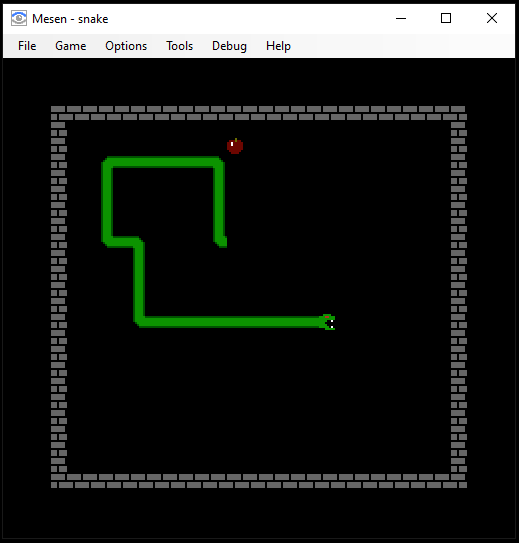
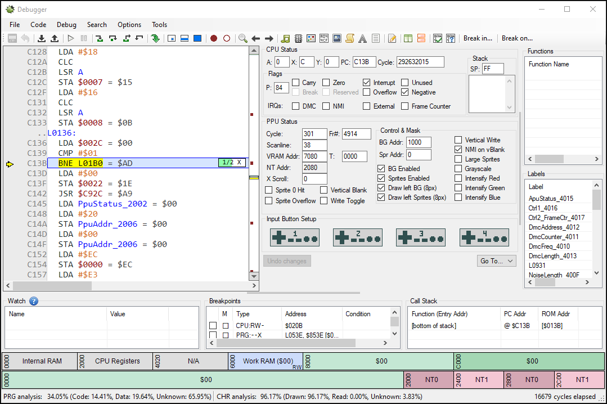

# Challenge 8 - Snake

The eighth Flare-On challenge archive contains a NES ROM and the following message:

> The Flare team is attempting to pivot to full-time twitch streaming video games instead of reverse engineering computer software all day. We wrote our own classic NES game to stream content that nobody else has seen and watch those subscribers flow in. It turned out to be too hard for us to beat so we gave up. See if you can beat it and capture the internet points that we failed to collect.

This sounds super-exciting! Still being relatively early on in my reverse-engineering career I've seen little outside of x86/x64 - should be a great opportunity to learn something new.

First-off I decide to fire up the ROM in an emulator and see what we're dealing with. Mesen has been recommended to me, so I load up snake.nes and away we go.



After a few rounds it appears this is indeed Snake. For those who don't know (hah), the object of Snake is to control your roving serpent as it makes its way around the game area, avoding the sides and consuming apples to grow. As you get larger and older, avoiding your own flabby body becomes more and more challenging - likely as a deep metaphor for the inherent futility of our consumer driven society.

*(Interesting aside - Snake was the the first game I ever played, on my Dad's work Compaq Portable at the age of 3. Unfortunately shortly after discovering Snake I discovered the even more exciting FORMAT C: command, at which point I was banned from said computer forever :( Happy ending though, my parents bought me a 128k Spectrum +2 to break instead and a misspent youth began.)*

Unfortunately due to this being the Age of Technology I have the attention span of a gnat on speed and as such grow bored quickly. Clearly I need to find some way to get to the end of this game and obtain the flag without actually having to play the darn thing. Mesen comes with a handy debugger/disassembler, so let's fire that up and see what we're dealing with:



Okay! So, there's a bunch of 6502 opcodes I'm unfamiliar with and various references to the PPU. Let's find out more about this processor:


Ehh...did I mention the attention span thing? Also, it feels like cracking this game is somewhat missing the point of what we've been asked to do - capture internet points by streaming a video of us winning. I want those internet points dammit.

Revisiting Mesen's debugger we appear to have a decent number of toys to play with, including a scripting engine. Maybe...we can just script the snake to play itself? We could build a clever algorithm that hunts down each apple with laser-like precision, always leaving itself just enough room to survive! On the other hand, we could do something really, really dumb which also allows me to achieve the requisite quota of human/family interation required today.

Firstly we need to figure out where the snake is and which way it's going. Fortunately Mesen's natty debugger also contains a live memory viewer. Firing that up and playing the game for a bit allows us to very quickly identify the bytes associated with direction, X position and Y position:


Offset | Purpose
------ | -------
0x0004/0x0005 | Direction (0x0 to 0x3)
0x0007 | X coordinate (0x0 to 0x17)
0x0008 | Y coordinate (0x0 to 0x15)

The current direction is stored in the bytes at both 0x0004 and 0x0005, with 0x0005 updating slightly before 0x0004. The X and Y coordinates are stored at 0x0007 and 0x0008 respectively. Armed with this information, we should have enough to automate our snake!

Firing up Mesen's script window we're presented with a handy sample script which gives us a great starting point, in addition to the awesome documentation at https://www.mesen.ca/docs/apireference.html. In order to write our script we'll want to read the current game state and then provide appropriate inputs. Interaction with the emulator is done via callbacks, in this case one on frame completion and one for polling input.

The following script segment contains the basic boilerplate for kicking off the game, registering callbacks and hitting the start button.

```lua
buttonToPress = { start = true }

function provideInput()
  emu.setInput(0, buttonToPress)
end

emu.addEventCallback(playGame, emu.eventType.endFrame)
emu.addEventCallback(provideInput, emu.eventType.inputPolled);
emu.displayMessage("Script", "AutoSnake loaded")
```

After that it's down to the main frame end callback to figure out where our snake is & where it's going, then send back the appropriate inputs as well as write some status information to the screen.

```lua
function playGame()
  dir = emu.read(0x5, cpu)
  x = emu.read(0x7, cpu)
  y = emu.read(0x8, cpu)  
  
  -- Right
  if dir == 0 then
    dirText = "right"
    if y > 20 then
      if x > 21 then
        buttonToPress = { up = true }
      end
    elseif x > 20 then
      buttonToPress = { down = true }
    end
  end
  
  -- Left
  if dir == 1 then
    dirText = "left"
    if x <= 1 then
      buttonToPress = { down = true }
    end
  end
  
  -- Down
  if dir == 3 then
    dirText = "down"
    if x < 13 then
      buttonToPress = { right = true }
    else
      buttonToPress = { left = true }
    end
  end
  
  -- Up
  if dir == 2 then
    dirText = "up"
    if y <= 1 then
      buttonToPress = { left = true }
    end
  end
  
  emu.drawString(10, 10, "x: " .. x .. ", y:" .. y .. ", dir: " .. dirText, 0xFFFFFF, 0xFF000000, 1)
end
```

After kicking off the script we can go grab a coffee while it plays. Full script available at [autosnake.lua](scripts/autosnake.lua) - note that the snake will still occasionally run headlong into the wall on the final full speed level - not clear if that's a bug in the emulator or ROM, but given we always restart on the most recent level our little serpentine friend will get there in the end.

Click the below image to see the full video:

[](images/AutoSnake.gif)

That's it! So yes I still need to go back and learn how this ROM actually works, but on the other hand I have an awesome video and all the internet points. Any comments or feedback feel free to let me know at steve@zyloid.com.